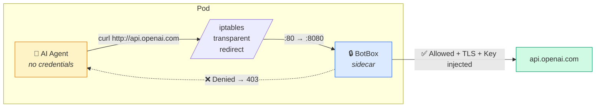
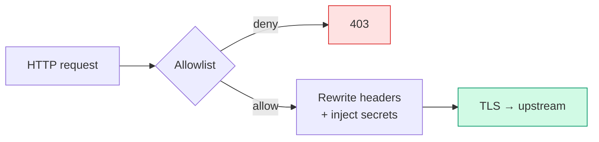
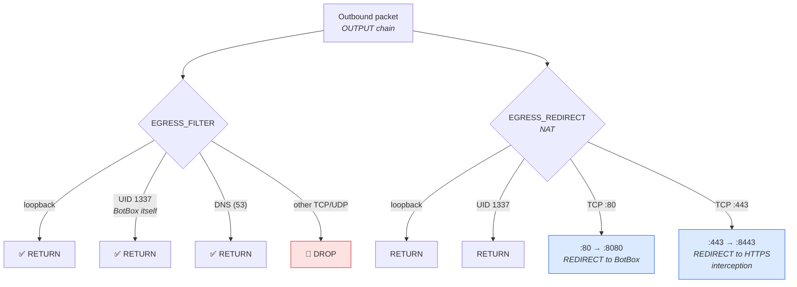

# BotBox

[](https://github.com/reoring/botbox/actions/workflows/ci.yml)
[](LICENSE)
[](https://www.rust-lang.org/)

[English](README.md) | 日本語

<p align="center">
  
</p>

**あらゆるコンテナのネットワークをサンドボックス化 — 特に AI エージェント向け。**

BotBox は Kubernetes のサイドカー型 egress プロキシです。iptables で Pod 内のアウトバウンド通信を透過的に傍受し、deny-by-default の allowlist を適用し、ネットワーク境界で API キー等のヘッダー注入を行います。これにより、アプリコンテナ自体は資格情報を保持せず、明示的に許可したホストにのみ到達できます。

> この README は `README.md` の日本語版です。内容の差異がある場合は英語版が正です。

### AI エージェントの封じ込め

自律型 AI エージェント（LLM ベースのコーディングエージェントや tool-use agent など）をコンテナで動かす場合、BotBox は強いネットワーク境界を提供します。

- **許可したホストにしか到達できない**: deny-by-default のポリシーで egress をブロックし、データ流出や未承認 API 呼び出しを抑止します。
- **エージェントは実キーを見ない**: 認証情報は Kubernetes Secret に置き、BotBox がネットワーク層で注入します。エージェントが環境変数やメモリをダンプしてもキーが出ません。
- **アプリ改修不要**: iptables の transparent redirect で proxy 設定不要。通常の HTTP リクエストを投げるだけで BotBox が処理します。
- **監査しやすい**: structured tracing により、どのホストにアクセスしようとしたか、許可/拒否の結果を追えます。



これは、**信頼できない/半信頼のコードを、制御可能で監査可能なネットワーク制約の下で動かしたい**ユースケースに自然にフィットします。

## 仕組み

### 動作モード

BotBox は 2 つのモードをサポートします。

1. **HTTP-only（デフォルト）** -- 80/tcp の平文 HTTP を傍受し、ヘッダーを書き換え、上流へは BotBox が TLS を張って転送します。アプリコンテナは `http://` でリクエストし、BotBox が HTTPS へアップグレードします。
2. **HTTPS Interception** -- 追加で 443/tcp のアウトバウンド HTTPS を 8443 で待つ TLS 終端リスナーへリダイレクトします。BotBox はローカル CA で短命な leaf 証明書を動的発行し、通信を復号して allowlist/ヘッダー注入を適用し、上流へ再暗号化して転送します。これにより、アプリが平文 HTTP を使わずに HTTPS リクエストに対して資格情報注入が可能になります。

### リクエスト処理



詳細な処理フローは `docs/architecture.md` を参照してください。

### iptables ネットワークルール



## HTTPS Interception モード

有効化すると、BotBox はサイドカーで TLS を終端し、上流へ再暗号化して転送します。HTTPS リクエスト内部のヘッダーを書き換えられるため、HTTP-only と同じ allowlist / header rewrite / secret injection を HTTPS に対して適用できます。

### どう動くか

1. iptables が 443/tcp のアウトバウンドを BotBox の HTTPS interception リスナー（8443）へリダイレクト。
2. BotBox はローカル CA 署名の leaf 証明書を動的発行して TLS を終端。
3. 復号した HTTP リクエストに対して allowlist 判定、ヘッダー書き換え、secret 注入。
4. 上流へ TLS で再暗号化して転送。

アプリコンテナは（ローカル CA を信頼していれば）正しい TLS として見え、proxy 設定は不要です。

### 設定

`config.yaml` に `https_interception` ブロックを追加します。

```yaml
https_interception:
  enabled: true
  listen_addr: "127.0.0.1"
  listen_port: 8443
  ca_cert_path: "/etc/botbox/https_interception/ca.crt"
  ca_key_path: "/etc/botbox/https_interception/ca.key"
  enforce_sni_host_match: true       # default: true -- reject requests where Host header != SNI
  deny_handshake_on_disallowed_sni: false  # default: false -- when true, refuse TLS handshake for non-allowlisted hosts
  cert_ttl_seconds: 86400            # default: 86400 (24h) -- leaf cert validity period
  cert_cache_size: 1024              # default: 1024 -- LRU cache capacity
  cert_cache_ttl_seconds: 3600       # default: 3600 (1h) -- cache entry TTL
  handshake_timeout_ms: 5000         # default: 5000 -- TLS handshake timeout
```

iptables 側（initContainer）で使う環境変数:

| 変数 | 説明 |
|---|---|
| `BOTBOX_ENABLE_HTTPS_INTERCEPTION` | `1` を設定すると 443/tcp の NAT redirect ルールを追加 |
| `BOTBOX_HTTPS_INTERCEPTION_PORT` | HTTPS interception の listen port を上書き（デフォルト: 8443） |

> **Note:** HTTPS interception は **両方** 必須です: 設定ファイルの `https_interception.enabled: true` と、iptables initContainer の `BOTBOX_ENABLE_HTTPS_INTERCEPTION=1`。前者は BotBox が TLS リスナーを起動するため、後者は 443 の redirect ルールを入れるためです。

> **Note:** `BOTBOX_ENABLE_HTTPS_INTERCEPTION=1` のとき `BOTBOX_REDIRECT_FROM_PORT=80`（デフォルト）を維持してください。`BOTBOX_REDIRECT_FROM_PORT=443` は HTTPS interception の redirect と衝突するため、init スクリプトは fail-fast します。

> **Note:** `BOTBOX_ENABLE_IPV6` は iptables initContainer の **必須** 環境変数（デフォルトなし）です。`1` で ip6tables へもルールをミラーします。`0` で IPv4 のみ。未設定だとスクリプトはエラーで終了します。

### HTTPS interception 用 iptables ルール

initContainer は 80/tcp の既存ルールに加えて 443/tcp の NAT redirect を追加する必要があります。

```bash
iptables -t nat -A EGRESS_REDIRECT -p tcp --dport 443 -j REDIRECT --to-port 8443
```

### アプリ側の CA 信頼

アプリコンテナは BotBox の CA 証明書（公開情報）を信頼する必要があります。CA cert のみをマウントし（秘密鍵は共有しない）、各ランタイムで trust store に設定してください。

| Runtime / Library | 環境変数やフラグ |
|---|---|
| curl / OpenSSL | `CURL_CA_BUNDLE=/etc/botbox/https_interception/ca.crt` または `SSL_CERT_FILE=/etc/botbox/https_interception/ca.crt` |
| Node.js | `NODE_EXTRA_CA_CERTS=/etc/botbox/https_interception/ca.crt` |
| Python requests | `REQUESTS_CA_BUNDLE=/etc/botbox/https_interception/ca.crt` |
| JVM (Java, Kotlin) | `-Djavax.net.ssl.trustStore=/path/to/truststore.jks`（CA cert を JKS に取り込み） |
| Go (net/http) | `SSL_CERT_FILE=/etc/botbox/https_interception/ca.crt` |

**Security note:** CA の **秘密鍵** をアプリコンテナへマウントしてはいけません。共有するのは CA cert のみです。秘密鍵は BotBox サイドカーだけが参照できるボリュームに置いてください。

### Kubernetes の落とし穴（example で得た知見）

- loopback bind と probe: BotBox の metrics サーバは `127.0.0.1` に bind します。また `https_interception.listen_addr` は loopback が必須です。Kubernetes の `httpGet` probe は Pod IP 宛に飛ぶため、`:9090/healthz`（や `:8443`）を `httpGet` にするとタイムアウトします。
- Pod の network namespace 内から `http://127.0.0.1:9090/healthz` を叩けるコンテナ（アプリ側、または小さな curl サイドカー）で `exec` probe を使うのがおすすめです。BotBox のデフォルトイメージは distroless のため `/bin/sh` や `curl` を含みません。

`exec` readiness probe の例:

```yaml
readinessProbe:
  exec:
    command:
      - /bin/sh
      - -c
      - curl -sf --connect-timeout 1 --max-time 1 http://127.0.0.1:9090/healthz >/dev/null
  initialDelaySeconds: 1
  periodSeconds: 2
  timeoutSeconds: 1
```

- 開発向けの ephemeral CA: example では initContainer で使い捨て CA を生成し `emptyDir` に置いています。開発には便利ですが、本番では Kubernetes Secret に安定した CA を置くのが一般的です。

## クイックスタート

### 前提

- Docker
- [kind](https://kind.sigs.k8s.io/)
- kubectl

### 1. イメージをビルドして kind にロード

```bash
docker build -t botbox:test .
docker build --target iptables-init -t botbox-iptables-init:test .
kind load docker-image botbox:test botbox-iptables-init:test
```

### 2. egress ポリシーを書く

```yaml
# config.yaml
allow_non_loopback: false  # 意図せず Pod 外へ公開しない
egress_policy:
  default_action: deny
  rules:
    - host: api.openai.com
      action: allow
      header_rewrites:
        - name: Authorization
          value: "Bearer {value}"
          secret_ref: openai-api-key   # K8s Secret から読み出す
```

### 3. Pod にサイドカーを追加

```yaml
initContainers:
  - name: iptables-init          # 推奨 iptables NAT+filter ルールをインストール
    image: botbox-iptables-init:test
    env:
      - name: BOTBOX_ENABLE_IPV6
        value: "1"              # 必須 — ip6tables / ip6table_nat がない場合は "0"
    securityContext:
      capabilities: { add: [NET_ADMIN] }
      runAsUser: 0
      runAsNonRoot: false

  - name: botbox                 # Pod ライフタイムで常駐
    image: botbox:test
    restartPolicy: Always
    args: ["--config", "/etc/botbox/config.yaml"]
    securityContext:
      runAsUser: 1337
      runAsNonRoot: true
    # ConfigMap と Secret を mount

containers:
  - name: app                    # アプリ側 — proxy 設定不要
    image: your-app:latest
    securityContext:
      runAsNonRoot: true
      runAsUser: 1000            # 1337（BotBox UID）にしない。owner-match を迂回できる
```

または、HTTPS interception 有効の ready-to-apply example を試せます。

```bash
kubectl apply -k examples/https_interception
kubectl -n botbox-https-interception rollout status deploy/botbox-https-interception-demo
kubectl -n botbox-https-interception exec -it deploy/botbox-https-interception-demo -c client -- sh
```

### 4. kind で acceptance test を実行（自動）

```bash
tests/e2e/run-kind-acceptance.sh
```

### 5. 個別に E2E を実行（任意）

```bash
tests/e2e/run-egress-test.sh
tests/e2e/run-https-interception-test.sh
```

### 6. unit test を実行

```bash
cargo test
```

## Why

| 課題 | BotBox の解決策 |
|---|---|
| API キーをアプリの env に置くと漏れる | キーは K8s Secret に置き、ネットワーク境界で注入 |
| アプリが HTTP_PROXY を設定しないといけない | iptables で透過傍受 — アプリ改修不要 |
| アウトバウンドが無制限 | deny-by-default allowlist で許可ホストのみ |
| キーローテーションに再起動が必要 | secrets dir を inotify で監視しホットリロード |

## ドキュメント

- `docs/architecture.md` — モジュール構成、リクエストフロー、iptables ルール、設定リファレンス
- `docs/security.md` — 脅威モデル、対策、ハードニング、残存リスク
