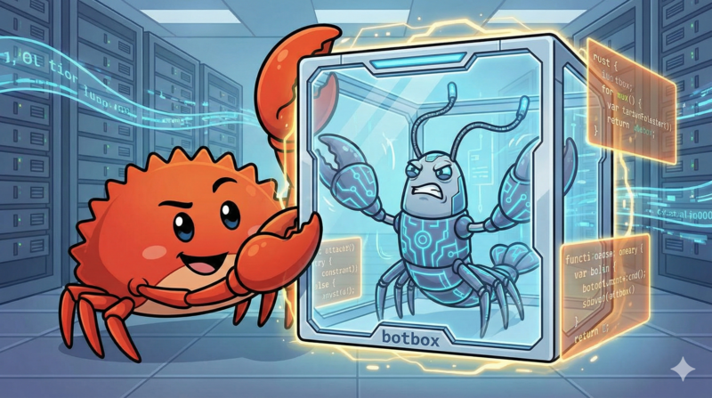
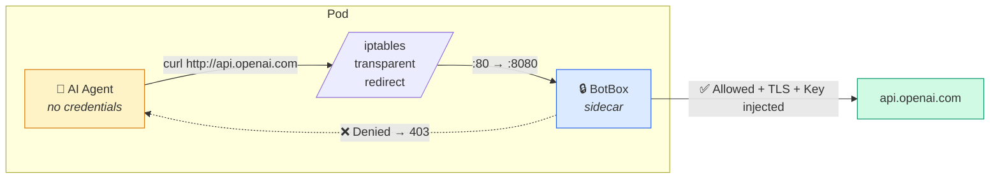
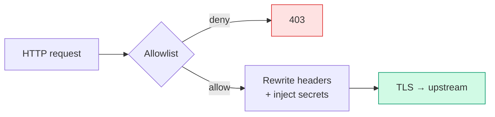
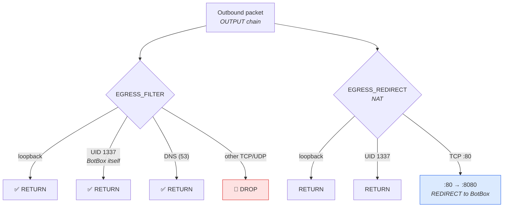

# BotBox

[](https://github.com/reoring/botbox/actions/workflows/ci.yml)
[](LICENSE)
[](https://www.rust-lang.org/)

<p align="center">
  
</p>

**Sandbox any container's network — especially AI agents.**

BotBox is a Kubernetes sidecar proxy that sits between your container and the internet. It intercepts all outbound traffic via iptables, enforces a deny-by-default allowlist, and injects API keys at the network boundary — so the container itself never holds credentials and can only reach hosts you explicitly permit.

### AI Agent Containment

Running an autonomous AI agent (LLM-based coding agent, tool-use agent, etc.) in a container? BotBox gives you a hard network boundary:

- **The agent can only reach hosts you allow.** Deny-by-default policy blocks all other egress — no data exfiltration, no unauthorized API calls.
- **The agent never sees real API keys.** Credentials are stored in Kubernetes Secrets and injected by BotBox at the network layer. Even if the agent dumps its own environment or memory, there are no keys to leak.
- **Zero app changes required.** iptables transparent redirect means the agent doesn't need proxy settings — it just makes normal HTTP requests and BotBox handles the rest.
- **Auditable.** Every request is logged with structured tracing. You can see exactly what your agent tried to reach and whether it was allowed or denied.



This makes BotBox a natural fit for any scenario where you need to **run untrusted or semi-trusted code** with controlled, auditable network access.

## How it Works

### Request Processing



See [Architecture](docs/architecture.md) for the full request processing pipeline.

### iptables Network Rules



## Quickstart

### Prerequisites

- Docker
- [kind](https://kind.sigs.k8s.io/)
- kubectl

### 1. Build and load the images

```bash
docker build -t botbox:test .
docker build --target iptables-init -t botbox-iptables-init:test .
kind load docker-image botbox:test botbox-iptables-init:test
```

### 2. Write your egress policy

```yaml
# config.yaml
allow_non_loopback: false  # keep false unless intentionally exposing outside the pod
egress_policy:
  default_action: deny
  rules:
    - host: api.openai.com
      action: allow
      header_rewrites:
        - name: Authorization
          value: "Bearer {value}"
          secret_ref: openai-api-key   # reads from K8s Secret
```

### 3. Add the sidecar to your pod

```yaml
initContainers:
  - name: iptables-init          # installs the recommended iptables NAT+filter rules
    image: botbox-iptables-init:test
    securityContext:
      capabilities: { add: [NET_ADMIN] }
      runAsUser: 0
      runAsNonRoot: false

  - name: botbox                  # runs for the pod's lifetime
    image: botbox:test
    restartPolicy: Always
    args: ["--config", "/etc/botbox/config.yaml"]
    securityContext:
      runAsUser: 1337
      runAsNonRoot: true
    # mount your ConfigMap and Secret here

containers:
  - name: app                     # your application — no proxy config needed
    image: your-app:latest
    securityContext:
      runAsNonRoot: true
      runAsUser: 1000             # must NOT be 1337 (BotBox UID) or iptables owner-match can be bypassed
```

### 4. Run acceptance tests on kind (automated)

```bash
tests/e2e/run-kind-acceptance.sh
```

### 5. Run individual E2E tests (optional)

```bash
tests/e2e/run-egress-test.sh
tests/e2e/run-https-interception-test.sh
```

### 6. Run unit tests

```bash
cargo test
```

## Why

| Problem | How BotBox solves it |
|---|---|
| API keys leaked in app env vars | Keys live only in K8s Secrets, injected at the network boundary |
| Apps must configure HTTP_PROXY | iptables makes interception transparent — zero app changes |
| Uncontrolled outbound traffic | Deny-by-default allowlist; only approved hosts are reachable |
| Key rotation requires restarts | Secrets directory is watched with inotify; hot-reload, no downtime |

## Documentation

- [Architecture](docs/architecture.md) — module structure, request flow, iptables rules, configuration reference
- [Security](docs/security.md) — threat model, controls, hardening checklist, residual risks
