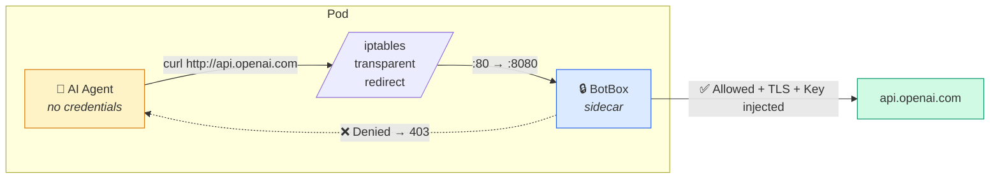
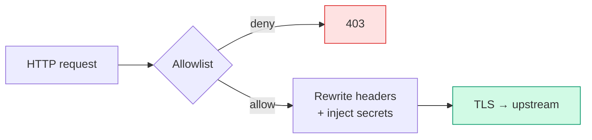
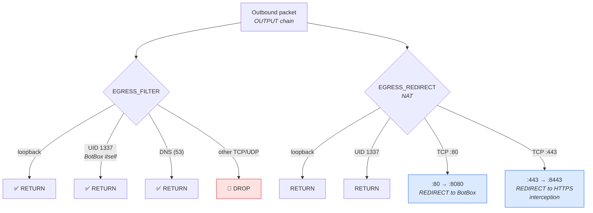

# BotBox

[](https://github.com/reoring/botbox/actions/workflows/ci.yml)
[](LICENSE)
[](https://www.rust-lang.org/)

<p align="center">
  
</p>

**Sandbox any container's network — especially AI agents.**

BotBox is a Kubernetes sidecar proxy that sits between your container and the internet. It intercepts all outbound traffic via iptables, enforces a deny-by-default allowlist, and injects API keys at the network boundary — so the container itself never holds credentials and can only reach hosts you explicitly permit.

### AI Agent Containment

Running an autonomous AI agent (LLM-based coding agent, tool-use agent, etc.) in a container? BotBox gives you a hard network boundary:

- **The agent can only reach hosts you allow.** Deny-by-default policy blocks all other egress — no data exfiltration, no unauthorized API calls.
- **The agent never sees real API keys.** Credentials are stored in Kubernetes Secrets and injected by BotBox at the network layer. Even if the agent dumps its own environment or memory, there are no keys to leak.
- **Zero app changes required.** iptables transparent redirect means the agent doesn't need proxy settings — it just makes normal HTTP requests and BotBox handles the rest.
- **Auditable.** Every request is logged with structured tracing. You can see exactly what your agent tried to reach and whether it was allowed or denied.



This makes BotBox a natural fit for any scenario where you need to **run untrusted or semi-trusted code** with controlled, auditable network access.

## How it Works

### Modes of Operation

BotBox supports two modes:

1. **HTTP-only (default)** -- Intercepts plaintext HTTP on port 80, rewrites headers, and originates TLS to upstream. App containers make `http://` requests and BotBox upgrades them to HTTPS.
2. **HTTPS Interception** -- Additionally intercepts outbound HTTPS on port 443 via a TLS-terminating listener on port 8443. BotBox dynamically issues short-lived leaf certificates signed by a local CA, decrypts the traffic, applies the same allowlist and header-rewrite pipeline, then re-encrypts to the upstream. This allows credential injection into HTTPS requests without requiring the app to use plaintext HTTP.

### Request Processing



See [Architecture](docs/architecture.md) for the full request processing pipeline.

### iptables Network Rules



## HTTPS Interception Mode

When enabled, BotBox intercepts outbound HTTPS traffic by terminating TLS at the sidecar and re-encrypting to the upstream. This lets BotBox inspect and rewrite headers inside HTTPS requests -- the same allowlist, header-rewrite, and credential-injection pipeline applies.

### How It Works

1. iptables redirects outbound TCP port 443 to BotBox's HTTPS interception listener on port 8443.
2. BotBox terminates TLS using a dynamically issued leaf certificate (signed by a local CA).
3. The decrypted HTTP request passes through the standard proxy pipeline (allowlist check, header rewrite, secret injection).
4. BotBox re-encrypts and forwards the request to the upstream over TLS.

The app container sees a valid TLS connection (signed by the local CA) and does not need any proxy configuration.

### Configuration

Add an `https_interception` block to your config:

```yaml
https_interception:
  enabled: true
  listen_addr: "127.0.0.1"
  listen_port: 8443
  ca_cert_path: "/etc/botbox/https_interception/ca.crt"
  ca_key_path: "/etc/botbox/https_interception/ca.key"
  enforce_sni_host_match: true       # default: true -- reject requests where Host header != SNI
  deny_handshake_on_disallowed_sni: false  # default: false -- when true, refuse TLS handshake for non-allowlisted hosts
  cert_ttl_seconds: 86400            # default: 86400 (24h) -- leaf cert validity period
  cert_cache_size: 1024              # default: 1024 -- LRU cache capacity
  cert_cache_ttl_seconds: 3600       # default: 3600 (1h) -- cache entry TTL
  handshake_timeout_ms: 5000         # default: 5000 -- TLS handshake timeout
```

Environment variable overrides:

| Variable | Description |
|---|---|
| `BOTBOX_ENABLE_HTTPS_INTERCEPTION` | Set to `1` in the iptables init container to add the port-443 NAT redirect |
| `BOTBOX_HTTPS_INTERCEPTION_PORT` | Override the HTTPS interception listen port (default: 8443) |

> **Note:** HTTPS interception requires **both** the config file setting (`https_interception.enabled: true`) and the iptables environment variable (`BOTBOX_ENABLE_HTTPS_INTERCEPTION=1`). The config tells BotBox to start the TLS listener; the environment variable tells the init container to install the NAT redirect rule.

> **Note:** `BOTBOX_ENABLE_IPV6` is a **required** environment variable for the iptables init container (no default). Set to `1` for dual-stack environments (mirrors all rules via ip6tables) or `0` for IPv4-only. The script exits with an error if this variable is not set.

### iptables Rules for HTTPS Interception

The init container must add a NAT redirect for port 443 in addition to the existing port 80 rule:

```bash
iptables -t nat -A EGRESS_REDIRECT -p tcp --dport 443 -j REDIRECT --to-port 8443
```

### App-side CA Trust

The app container must trust the BotBox CA certificate. Mount the CA cert (NOT the private key) into the app container and configure the runtime:

| Runtime / Library | Environment Variable or Flag |
|---|---|
| curl / OpenSSL | `CURL_CA_BUNDLE=/etc/botbox/https_interception/ca.crt` or `SSL_CERT_FILE=/etc/botbox/https_interception/ca.crt` |
| Node.js | `NODE_EXTRA_CA_CERTS=/etc/botbox/https_interception/ca.crt` |
| Python requests | `REQUESTS_CA_BUNDLE=/etc/botbox/https_interception/ca.crt` |
| JVM (Java, Kotlin) | `-Djavax.net.ssl.trustStore=/path/to/truststore.jks` (import the CA cert into a JKS truststore) |
| Go (net/http) | `SSL_CERT_FILE=/etc/botbox/https_interception/ca.crt` |

**Security note:** The CA **private key** must NOT be mounted into app containers. Only the CA certificate (public) should be shared. The private key must be in a separate volume accessible only to the BotBox sidecar.

## Quickstart

### Prerequisites

- Docker
- [kind](https://kind.sigs.k8s.io/)
- kubectl

### 1. Build and load the images

```bash
docker build -t botbox:test .
docker build --target iptables-init -t botbox-iptables-init:test .
kind load docker-image botbox:test botbox-iptables-init:test
```

### 2. Write your egress policy

```yaml
# config.yaml
allow_non_loopback: false  # keep false unless intentionally exposing outside the pod
egress_policy:
  default_action: deny
  rules:
    - host: api.openai.com
      action: allow
      header_rewrites:
        - name: Authorization
          value: "Bearer {value}"
          secret_ref: openai-api-key   # reads from K8s Secret
```

### 3. Add the sidecar to your pod

```yaml
initContainers:
  - name: iptables-init          # installs the recommended iptables NAT+filter rules
    image: botbox-iptables-init:test
    env:
      - name: BOTBOX_ENABLE_IPV6
        value: "1"              # required — set to "0" if ip6tables or ip6table_nat is unavailable
    securityContext:
      capabilities: { add: [NET_ADMIN] }
      runAsUser: 0
      runAsNonRoot: false

  - name: botbox                  # runs for the pod's lifetime
    image: botbox:test
    restartPolicy: Always
    args: ["--config", "/etc/botbox/config.yaml"]
    securityContext:
      runAsUser: 1337
      runAsNonRoot: true
    # mount your ConfigMap and Secret here

containers:
  - name: app                     # your application — no proxy config needed
    image: your-app:latest
    securityContext:
      runAsNonRoot: true
      runAsUser: 1000             # must NOT be 1337 (BotBox UID) or iptables owner-match can be bypassed
```

### 4. Run acceptance tests on kind (automated)

```bash
tests/e2e/run-kind-acceptance.sh
```

### 5. Run individual E2E tests (optional)

```bash
tests/e2e/run-egress-test.sh
tests/e2e/run-https-interception-test.sh
```

### 6. Run unit tests

```bash
cargo test
```

## Why

| Problem | How BotBox solves it |
|---|---|
| API keys leaked in app env vars | Keys live only in K8s Secrets, injected at the network boundary |
| Apps must configure HTTP_PROXY | iptables makes interception transparent — zero app changes |
| Uncontrolled outbound traffic | Deny-by-default allowlist; only approved hosts are reachable |
| Key rotation requires restarts | Secrets directory is watched with inotify; hot-reload, no downtime |

## Documentation

- [Architecture](docs/architecture.md) — module structure, request flow, iptables rules, configuration reference
- [Security](docs/security.md) — threat model, controls, hardening checklist, residual risks
